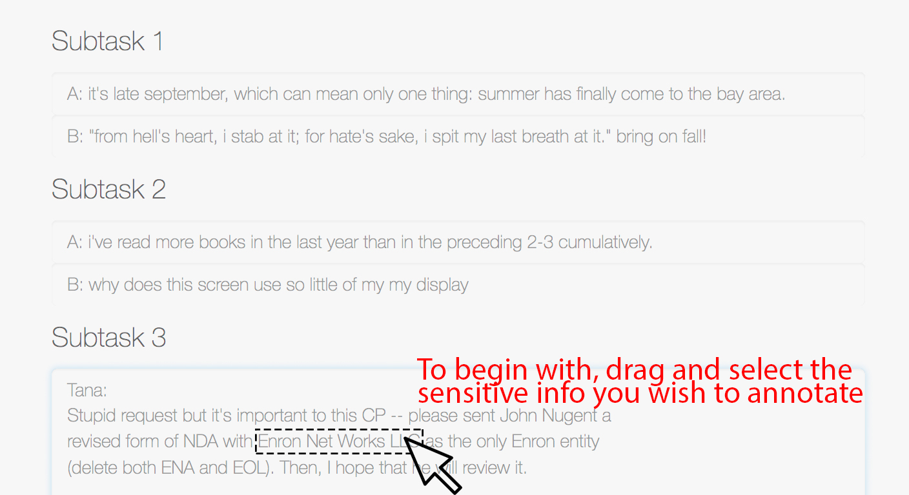
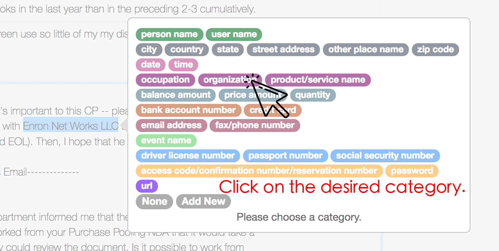
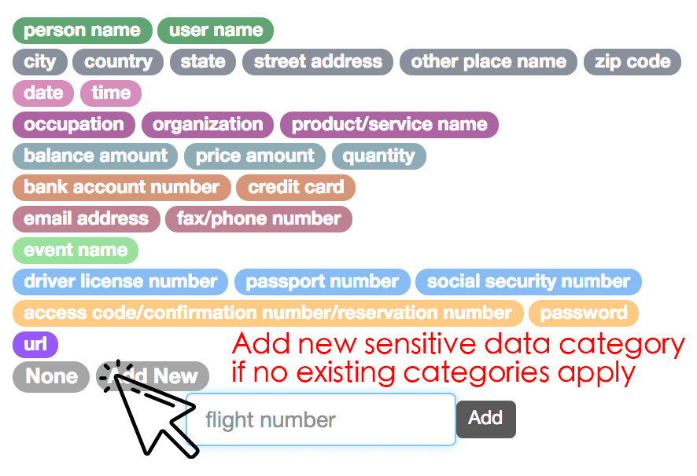
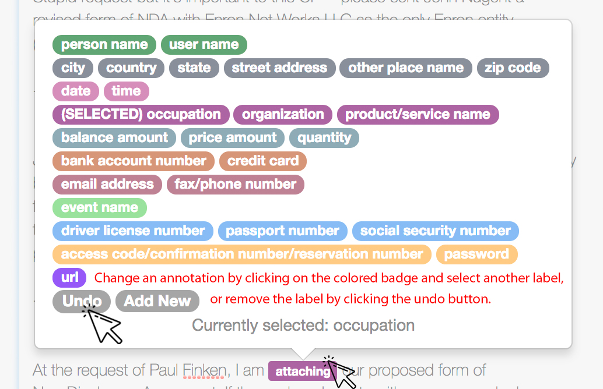

# CrowdAnnotator

This was designed as a web-based Scrubber interface for PII (personally identifiable information).

It can be used as a general-purpose crowd-sourcing system for all sorts of
text annotation tasks.

It was designed to be used with [Amazon Mechanical Turk](https://www.mturk.com/).

## Pre-defined Annotation Categories
Change predefined annotation categories at
[myScrubber/static/js/scrubber.js](myScrubber/static/js/scrubber.js)

For auto-generation of categories definition in that js file, see [categories](categories)
directory

## User Interface
#### Step 1

#### Step 2

#### Step 3

#### Step 4

